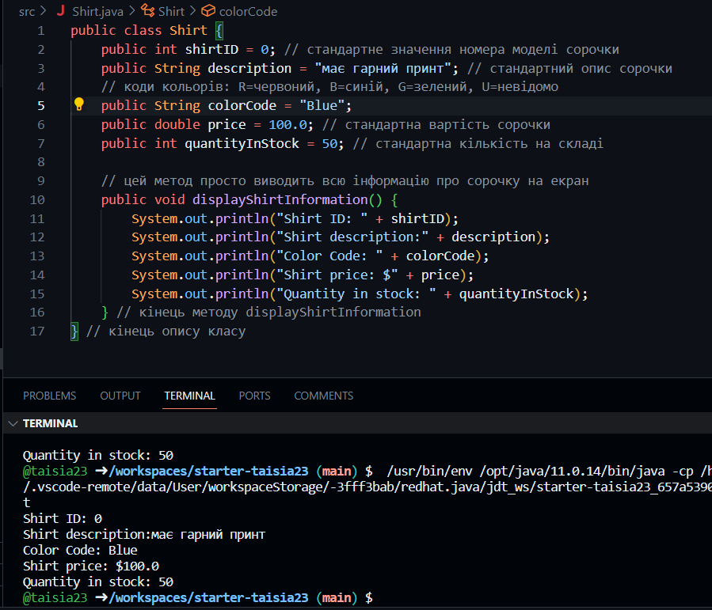

# Завдання 1


````java
public class Shirt {
    public int shirtID = 0; // стандартне значення номера моделі сорочки
    public String description = "має гарний принт"; // стандартний опис сорочки
    // коди кольорів: R=червоний, B=синій, G=зелений, U=невідомо
    public char colorCode = 'B';
    public double price = 100.0; // стандартна вартість сорочки
    public int quantityInStock = 50; // стандартна кількість на складі

    // цей метод просто виводить всю інформацію про сорочку на екран
    public void displayShirtInformation() {
        System.out.println("Shirt ID: " + shirtID);
        System.out.println("Shirt description:" + description);
        System.out.println("Color Code: " + colorCode);
        System.out.println("Shirt price: $" + price);
        System.out.println("Quantity in stock: " + quantityInStock);
    } // кінець методу displayShirtInformation
} // кінець опису класу
````
# колір сорочки зберігається та виводиться у вигляді рядка



````java
public class Shirt {
    public int shirtID = 0; // стандартне значення номера моделі сорочки
    public String description = "має гарний принт"; // стандартний опис сорочки
    // коди кольорів: R=червоний, B=синій, G=зелений, U=невідомо
    public String colorCode = "Blue";
    public double price = 100.0; // стандартна вартість сорочки
    public int quantityInStock = 50; // стандартна кількість на складі

    // цей метод просто виводить всю інформацію про сорочку на екран
    public void displayShirtInformation() {
        System.out.println("Shirt ID: " + shirtID);
        System.out.println("Shirt description:" + description);
        System.out.println("Color Code: " + colorCode);
        System.out.println("Shirt price: $" + price);
        System.out.println("Quantity in stock: " + quantityInStock);
    } // кінець методу displayShirtInformation
} // кінець опису класу
````
