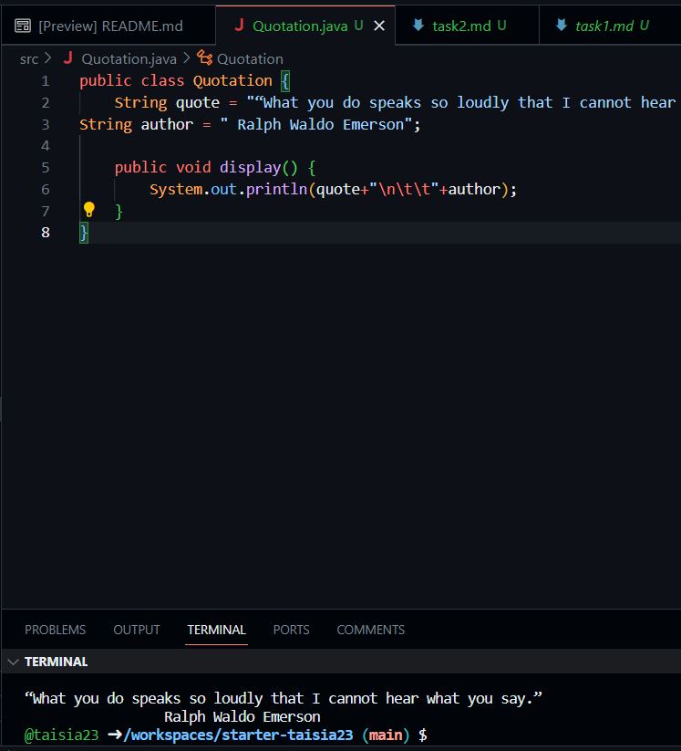

#Завдання 2

****java
public class Quotation {
    String quote = "“What you do speaks so loudly that I cannot hear what you say.”";
String author = " Ralph Waldo Emerson";

    public void display() {
        System.out.println(quote+"\n\t\t"+author);
    }
}
****